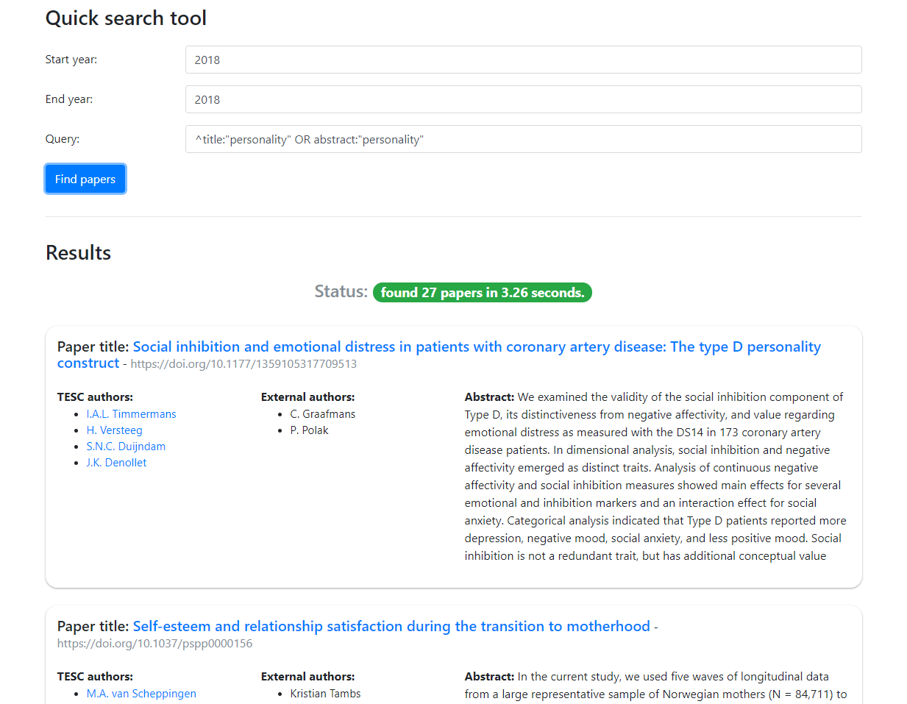

## Web Interface for TESC Publishing KPIs

### Project description 
- this project builds upon the **Publishing KPIs for Tilburg Experience Sampling Center** parent project which [can be accessed here](https://github.com/mihaiconstantin/TescPerf/)
- in essence, this project is just a web interface around the command line utility developed in the parent project
- for a detailed description of the functionality provided, please check this [`README.md`](https://github.com/mihaiconstantin/TescPerf/blob/master/README.md)
- the web interface is built with:
	- [`Flask`](https://github.com/pallets/flask/) micro-framework for the backend
	- [`Vue.js`](https://github.com/vuejs/vue) for the frontend

### Installation
- **prerequisites:** `Python 3`, the `pip` package manager, and `virtualenv` need to be installed and available from your terminal
- **installation steps:**
	- clone the `git` repository and `cd` into `TescPerf/`
	- create a virtual environment by running `virtualenv venv`
	- run `cd venv/Scripts` followed by `activate.bat` if you are on Windows, or `./activate` for Linux
	- run `cd ..` **two times** to get back to the root directory of the project (i.e., running it all in a single command would be offensive---go ahead)
	- install the project dependencies by running `pip install -r requirements.txt`
	- finally, we need to set some variables for `flask` (i.e., see http://flask.pocoo.org/docs/0.12/quickstart/ for Linux instructions). For Windows, type the following in the terminal:
		- `set FLASK_APP=app.py`
		- `set FLASK_DEBUG=1`
- **development** <u>(skip to `Usage` section if not interested)</u>:
	- if you are interested in modifying the frontend interface, you also need [`Node.js`](https://nodejs.org/en/) and the `npm` package manager to be installed and accessible from your terminal
	- to start the `webpack` developmental server with hot module replacement:
		- run `cd client/` and uncomment this line in `index.html`: `<!--  -->`
		- then, run `npm install` to install the dependencies
		- finally, `npm run dev` and the interface will be visible at http://localhost:8080

### Usage
- run `flask run` and access the application in your browser at http://localhost:5000
- fill in the form elements and click `Find papers` to search for publications
	- the steps taken in finding the papers are printed to the console (i.e., see the documentation for the parent project for a detailed description)
	- the publications and the data extracted are presented as cards. The hyperlinks to the publication page and the author page are also provided.
	- advanced search queries are possible, as long as they are supported by the https://pure.uvt.nl portal (i.e., check the [`README.md`](https://github.com/mihaiconstantin/TescPerf/blob/master/README.md) of the parent project for more details)
- here is a quick look at the web interface:

### Contact
- if you have any questions regarding this tool feel free to drop me a line at m.a.constantin@uvt.nl
